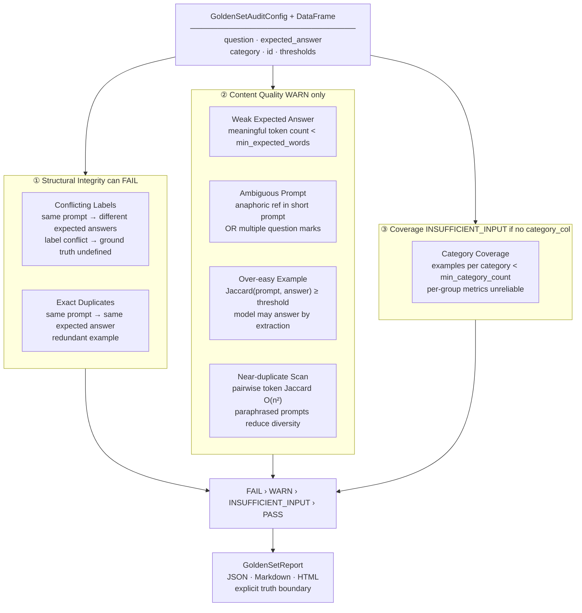

# GoldenSetAuditor

**Evaluation dataset quality auditor for LLM / RAG applications.**

<p>
  
  
  
  
</p>

<p>
  
  
  
</p>

GoldenSetAuditor audits golden evaluation datasets for LLM and RAG applications before benchmark scores are trusted. It does not score model outputs — it audits the dataset being scored against.

## About

Nobody questions the golden set. It's treated as ground truth — the fixed reference that tells you whether your model improved. But golden sets are assembled by humans, often under deadline pressure, from domain knowledge that isn't always consistent or independently reviewed. The same question appears twice with different expected answers. A near-trivial question makes up a third of a category. A reference answer is one word. An ambiguous pronoun in a prompt means no single correct answer exists.

None of this is visible in the benchmark score itself. A bad golden set doesn't produce obviously wrong numbers — it produces confidently wrong ones. You don't know the score is unreliable until you dig into why a supposedly better model regressed, or why two domain experts disagree on whether an answer was correct.

The deeper problem is circular. You're using the golden set to validate the model, but nothing is validating the golden set. The tool that needs quality assurance is the one everyone assumes is already correct.

GoldenSetAuditor breaks that circularity. Feed it the DataFrame backing your evaluation suite, and it checks for conflicting labels, duplicate prompts, weak reference answers, ambiguous questions, over-easy examples, near-duplicate pairs, and category coverage gaps. The output is a per-finding audit report in JSON, Markdown, and HTML — structured, row-level, and attachable to your evaluation documentation before a single benchmark score is published.

The truth boundary is explicit on every report: this tool audits dataset quality. It does not evaluate model answers.

## Architecture



## The 7 checks

| Group | Check | Method | Status |
|---|---|---|---|
| Structural | Conflicting labels | Exact match on normalised input text; answers differ | **FAIL** |
| Structural | Exact duplicates | Exact match on normalised input text; answers match | WARN |
| Content | Weak expected answer | Meaningful token count after stopword filter | WARN |
| Content | Ambiguous prompt | Anaphoric reference pattern + multi-question heuristic | WARN |
| Content | Over-easy example | Token Jaccard between prompt and expected answer | WARN |
| Content | Near-duplicate scan | Pairwise token Jaccard across all prompt pairs (O(n²)) | WARN or INSUFFICIENT_INPUT |
| Coverage | Category coverage | Example count per category value | WARN or INSUFFICIENT_INPUT |

Only conflicting labels can produce FAIL — the ground truth is structurally undefined. Everything else is WARN: suspicious, requiring human confirmation.

## Truth boundary

GoldenSetAuditor does **not** evaluate model answers. It audits the evaluation dataset. It does not check whether expected answers are factually correct, whether the evaluation metric (exact match, ROUGE, LLM-judge) is appropriate, whether the golden set covers the production query distribution, or whether pretraining contamination has occurred.

## Install

```bash
pip install goldensetauditor
```

## Quickstart

```python
import pandas as pd
from goldensetauditor import GoldenSetAuditConfig, audit_golden_set

df = pd.read_csv("data/demo_golden_set.csv")

config = GoldenSetAuditConfig(
    input_col="question",
    expected_col="expected_answer",
    category_col="category",
    id_col="id",
)

report = audit_golden_set(df, config)

print(report.status)       # FAIL / WARN / PASS
report.save("outputs/")    # writes JSON, Markdown, HTML
```

## Run the demo

```bash
git clone https://github.com/SidharthKriplani/goldensetauditor
cd goldensetauditor
pip install -e .
python scripts/generate_demo_reports.py
open outputs/goldensetauditor_report.html
```

## Resume-safe claim

Built **GoldenSetAuditor**, an evaluation dataset quality auditor for LLM/RAG applications that checks golden sets for conflicting expected answers, exact and near-duplicate prompts, weak reference answers, ambiguous questions, over-easy examples, and category coverage gaps, producing structured JSON/Markdown/HTML audit reports with per-finding PASS/WARN/FAIL/INSUFFICIENT_INPUT status and explicit truth boundary.

## Roadmap

- Semantic near-duplicate detection via sentence embeddings (alternative to token Jaccard)
- Pretraining contamination flag (n-gram overlap against known public corpora)
- Multi-turn / context-dependent conversation auditing

## License

MIT
