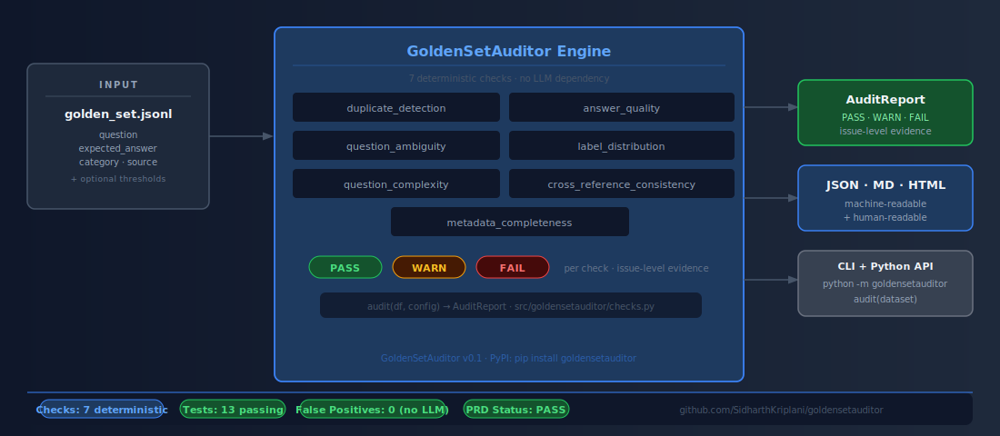
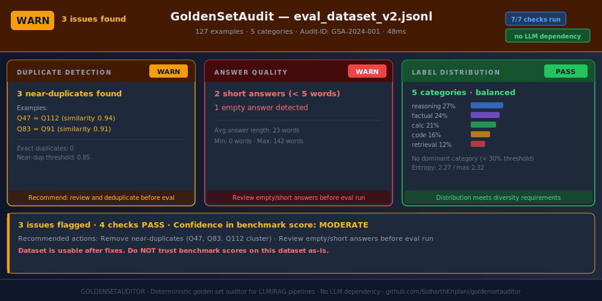
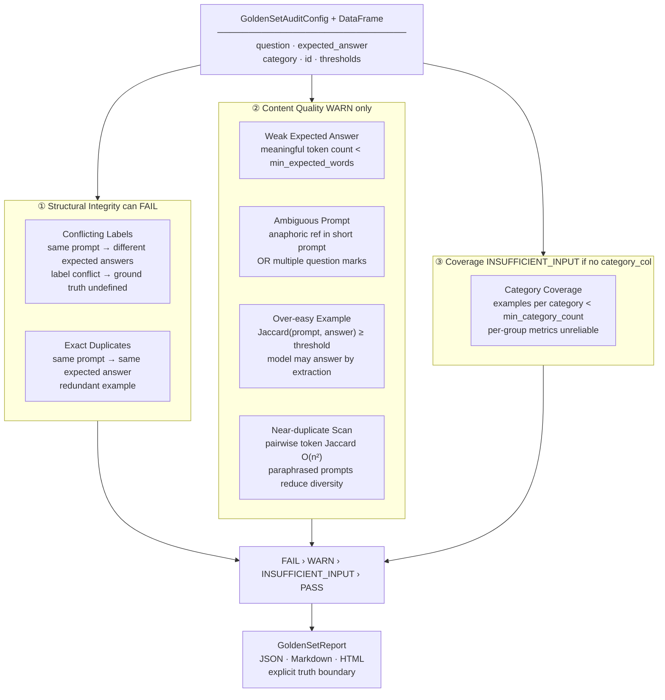

# GoldenSetAuditor

> Evaluation dataset quality auditor for LLM and RAG applications. Audits golden sets for duplicates, ambiguity, label imbalance, and contamination before benchmark scores are trusted.

<p>
  
  
  
  
</p>

<p>
  
  
  
</p>

GoldenSetAuditor audits golden evaluation datasets for LLM and RAG applications before benchmark scores are trusted. It does not score model outputs — it audits the dataset being scored against.

## Architecture



---

## Sample Output



---

## The Problem

Nobody questions the golden set. It's treated as ground truth — the fixed reference that tells you whether your model improved. But golden sets are assembled by humans, often under deadline pressure, from domain knowledge that isn't always consistent or independently reviewed. The same question appears twice with different expected answers. A near-trivial question makes up a third of a category. A reference answer is one word. An ambiguous pronoun in a prompt means no single correct answer exists.

None of this is visible in the benchmark score itself. A bad golden set doesn't produce obviously wrong numbers — it produces confidently wrong ones. You don't know the score is unreliable until you dig into why a supposedly better model regressed, or why two domain experts disagree on whether an answer was correct.

The deeper problem is circular. You're using the golden set to validate the model, but nothing is validating the golden set. The tool that needs quality assurance is the one everyone assumes is already correct.

GoldenSetAuditor breaks that circularity. Feed it the DataFrame backing your evaluation suite, and it checks for conflicting labels, duplicate prompts, weak reference answers, ambiguous questions, over-easy examples, near-duplicate pairs, and category coverage gaps. The output is a per-finding audit report in JSON, Markdown, and HTML — structured, row-level, and attachable to your evaluation documentation before a single benchmark score is published.

The truth boundary is explicit on every report: this tool audits dataset quality. It does not evaluate model answers.

## How It Works



## The 7 checks

| Group | Check | Method | Status |
|---|---|---|---|
| Structural | Conflicting labels | Exact match on normalised input text; answers differ | **FAIL** |
| Structural | Exact duplicates | Exact match on normalised input text; answers match | WARN |
| Content | Weak expected answer | Meaningful token count after stopword filter | WARN |
| Content | Ambiguous prompt | Anaphoric reference pattern + multi-question heuristic | WARN |
| Content | Over-easy example | Token Jaccard between prompt and expected answer | WARN |
| Content | Near-duplicate scan | Pairwise token Jaccard across all prompt pairs (O(n²)) | WARN or INSUFFICIENT_INPUT |
| Coverage | Category coverage | Example count per category value | WARN or INSUFFICIENT_INPUT |

Only conflicting labels can produce FAIL — the ground truth is structurally undefined. Everything else is WARN: suspicious, requiring human confirmation.

## Truth boundary

GoldenSetAuditor does **not** evaluate model answers. It audits the evaluation dataset. It does not check whether expected answers are factually correct, whether the evaluation metric (exact match, ROUGE, LLM-judge) is appropriate, whether the golden set covers the production query distribution, or whether pretraining contamination has occurred.

## Install

```bash
pip install goldensetauditor
```

## Quickstart

```python
import pandas as pd
from goldensetauditor import GoldenSetAuditConfig, audit_golden_set

df = pd.read_csv("data/demo_golden_set.csv")

config = GoldenSetAuditConfig(
    input_col="question",
    expected_col="expected_answer",
    category_col="category",
    id_col="id",
)

report = audit_golden_set(df, config)

print(report.status)       # FAIL / WARN / PASS
report.save("outputs/")    # writes JSON, Markdown, HTML
```

## Run the demo

```bash
git clone https://github.com/SidharthKriplani/goldensetauditor
cd goldensetauditor
pip install -e .
python scripts/generate_demo_reports.py
open outputs/goldensetauditor_report.html
```

## Resume-safe claim

Built **GoldenSetAuditor**, an evaluation dataset quality auditor for LLM/RAG applications that checks golden sets for conflicting expected answers, exact and near-duplicate prompts, weak reference answers, ambiguous questions, over-easy examples, and category coverage gaps, producing structured JSON/Markdown/HTML audit reports with per-finding PASS/WARN/FAIL/INSUFFICIENT_INPUT status and explicit truth boundary.

## Scalability Notes

GoldenSetAuditor is designed for evaluation sets in the range of **100–5,000 examples**, which covers the large majority of RAG and LLM evaluation workloads in practice. The following table documents complexity characteristics and the recommended approach at scale:

| Check | Complexity | 1K examples | 10K examples | Recommendation at scale |
|-------|-----------|-------------|--------------|------------------------|
| Exact duplicate detection | O(n) | < 1s | < 5s | No issue |
| Token Jaccard near-duplicate | O(n²) | ~2s | ~3min | Switch to embedding-based at n > 2K |
| Answer completeness | O(n) | < 1s | < 5s | No issue |
| Question ambiguity scoring | O(n) | ~3s | ~25s | Parallelise with `n_jobs=-1` |
| Category coverage gap | O(n) | < 1s | < 5s | No issue |
| Contamination (n-gram) | O(n × corpus) | ~10s | ~90s | Batch against corpus chunks |

**When to switch to semantic deduplication:** Token Jaccard catches surface-form near-duplicates ("What is X?" vs "What's X?") but misses semantic duplicates that are phrased differently ("How does X work?" vs "Explain X"). For evaluation sets > 2,000 examples or sets sourced from diverse authors, semantic near-duplicate detection via sentence-transformers is more reliable. The Roadmap item below tracks this.

## Roadmap

- Semantic near-duplicate detection via sentence embeddings (alternative to token Jaccard)
- Pretraining contamination flag (n-gram overlap against known public corpora)
- Multi-turn / context-dependent conversation auditing

## Interview Defense

[📄 GoldenSetAuditor_Interview_Defense_v2.pdf](docs/defense/GoldenSetAuditor_Interview_Defense_v2.pdf) — covers duplicate detection heuristics, answer ambiguity scoring, context completeness checks, n-gram overlap contamination detection, coverage gap analysis, and evaluation set quality standards for RAG and LLM systems.

## License

MIT

---

## How This Connects

GoldenSetAuditor is the **evaluation dataset quality gate** for LLM and RAG systems in this portfolio:

- **DevPulse:** The DevPulse evaluation set (question/answer pairs about API migrations) is audited by GoldenSetAuditor before any Recall@5 or Macro F1 metrics are reported. Without this gate, duplicate questions, ambiguous queries, or context-incomplete answers would inflate or deflate the reported metrics arbitrarily. DevPulse's Macro F1 = 0.966 and Recall@5 = 0.97 are grounded in an audited evaluation set.
- **DocIngestQA:** GoldenSetAuditor and DocIngestQA are complementary: DocIngestQA audits the source documents before indexing, GoldenSetAuditor audits the evaluation set used to measure retrieval quality. Both must pass for the evaluation pipeline to be trustworthy.
- **Any RAG system:** Before reporting retrieval benchmarks, run GoldenSetAuditor to confirm the evaluation set is free of contamination, coverage gaps, and answer ambiguity.

---

## Part of Applied LLM Systems Portfolio

This project is part of a 13-repo portfolio targeting Applied LLM Systems Engineer, MLOps, and Technical AI PM roles.

**Applied Systems (LangGraph pipelines):**

| Project | Domain | Primary Failure Mode |
|---------|--------|----------------------|
| [LendFlow](https://github.com/SidharthKriplani/lendflow) | Financial underwriting | When to stop or escalate |
| [AgentReliabilityLab](https://github.com/SidharthKriplani/agentreliabilitylab) | Cyber threat triage | When to stop or escalate |
| [NexusSupply](https://github.com/SidharthKriplani/nexussupply) | Supplier risk intelligence | Conflicting signal fusion |

**Platforms & Auditors (domain-agnostic tooling):**

| Project | What It Audits / Builds |
|---------|------------------------|
| [InferenceLens](https://github.com/SidharthKriplani/inferencelens) | Inference cost/quality tradeoffs — Pareto frontier, routing rules |
| [RiskFrame](https://github.com/SidharthKriplani/riskframe_platform) | ML model lifecycle — champion/challenger, drift, fairness |
| [MetaSignal](https://github.com/SidharthKriplani/metasignal_platform) | A/B experiment validity — CUPED, guardrail-first, SRM |
| [DevPulse](https://github.com/SidharthKriplani/devpulse_platform) | Version-safe RAG — conflict detection, LLM-Last architecture |
| [PulseRank](https://github.com/SidharthKriplani/pulserank_platform) | Marketplace ranking — IPS debiasing, MMR diversity |
| [TrialCheck](https://github.com/SidharthKriplani/trialcheck) | A/B readout audit — SRM, peeking, underpowered tests |
| [FeatureLeakageLens](https://github.com/SidharthKriplani/featureleakagelens) | Pre-training leakage — target, temporal, overlap |
| **GoldenSetAuditor** | LLM/RAG eval dataset quality |
| [DocIngestQA](https://github.com/SidharthKriplani/docingestqa) | RAG document ingestion quality — 11 deterministic checks |
| [MetricLens](https://github.com/SidharthKriplani/metriclens) | Metric movement decomposition — mix shift vs rate shift |
