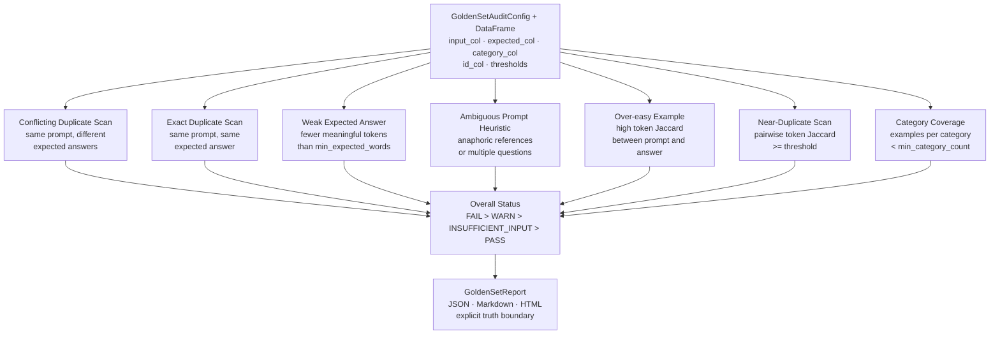

# GoldenSetAuditor

**Evaluation dataset quality auditor for LLM / RAG applications.**

<p>
  
  
  
  
</p>

<p>
  
  
  
</p>

GoldenSetAuditor audits golden evaluation datasets for LLM and RAG applications **before benchmark scores are trusted**. It is intentionally an auditor, not a scorer — it returns structured `PASS / WARN / FAIL / INSUFFICIENT_INPUT` findings and asks the team to review suspicious examples rather than claiming it can automatically fix evaluation quality.

## About

Golden sets are the foundation of LLM/RAG evaluation. A golden set that contains duplicate prompts, conflicting expected answers, weak reference answers, or ambiguous questions will produce misleading benchmark scores — whether the model improved or not.

These problems are common because golden sets are often assembled manually or by automated pipelines that prioritise coverage over quality. They are typically caught only when scores seem implausible, when a model revision produces unexpected regressions, or when a domain expert manually reviews examples during a post-mortem.

GoldenSetAuditor makes the evaluation dataset review step systematic and reportable. It runs a structured set of checks against the golden set DataFrame, produces a per-finding audit report, and surfaces issues for human review before scores are used for any decision. The truth boundary is explicit in every report: the tool flags suspicious patterns; the evaluation lead confirms whether an example is valid.

## Architecture



## Why this exists

LLM and RAG benchmark scores are only as reliable as the golden set they are measured against. Common failure modes:

- **Conflicting labels** — the same prompt appears with different expected answers, producing undefined ground truth
- **Exact duplicates** — repeated examples inflate recall metrics and bias fine-tuned models
- **Weak expected answers** — single-token or near-empty reference answers that can't distinguish good from bad model outputs
- **Ambiguous prompts** — anaphoric references or multi-part questions that lack a single correct answer
- **Over-easy examples** — the prompt essentially contains the answer, rewarding retrieval over reasoning
- **Near-duplicates** — paraphrased prompts that reduce coverage diversity without adding signal
- **Category imbalance** — underpopulated categories produce unreliable per-category metrics

GoldenSetAuditor makes that review systematic and reportable before scores inform any decision.

## Truth boundary

GoldenSetAuditor does **not** evaluate model answers. It audits the evaluation dataset itself. Human judgment is required to decide whether a flagged example should be removed, corrected, or kept as-is. It is not a replacement for domain expert review, annotation guidelines, or inter-annotator agreement measurement.

## Install

```bash
pip install goldensetauditor
```

## Quickstart

```python
import pandas as pd
from goldensetauditor import GoldenSetAuditConfig, audit_golden_set

df = pd.read_csv("data/demo_golden_set.csv")

config = GoldenSetAuditConfig(
    input_col="question",
    expected_col="expected_answer",
    category_col="category",
    id_col="id",
)

report = audit_golden_set(df, config)

print(report.status)           # FAIL / WARN / PASS
report.save("outputs/")        # writes JSON, Markdown, HTML
```

## Run the demo

```bash
git clone https://github.com/SidharthKriplani/goldensetauditor
cd goldensetauditor
pip install -e .
python scripts/generate_demo_reports.py
open outputs/goldensetauditor_report.html
```

## Run tests

```bash
python -m unittest discover -s tests -v
```

## The 7 checks

| Check | What it detects |
|---|---|
| Conflicting duplicate scan | Same prompt with different expected answers — label conflict |
| Exact duplicate scan | Same prompt with same expected answer — redundant example |
| Weak expected answer | Expected answer with fewer meaningful tokens than threshold |
| Ambiguous prompt heuristic | Anaphoric references or multiple questions in a single prompt |
| Over-easy example | High token Jaccard between prompt and expected answer |
| Near-duplicate scan | Paraphrased prompts with high pairwise token similarity |
| Category coverage | Categories with fewer examples than min_category_count |

## Resume-safe claim

Built **GoldenSetAuditor**, an evaluation dataset quality auditor for LLM/RAG applications that checks golden sets for conflicting expected answers, exact and near-duplicate prompts, weak reference answers, ambiguous questions, over-easy examples, and category coverage gaps, producing structured JSON/Markdown/HTML audit reports with per-finding PASS/WARN/FAIL/INSUFFICIENT_INPUT status and explicit truth boundary.

## License

MIT
